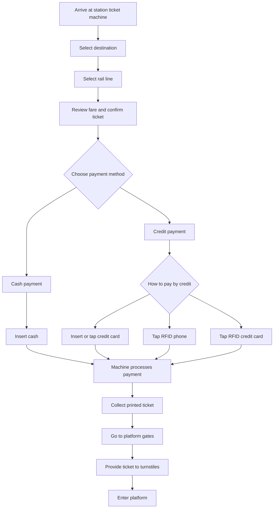
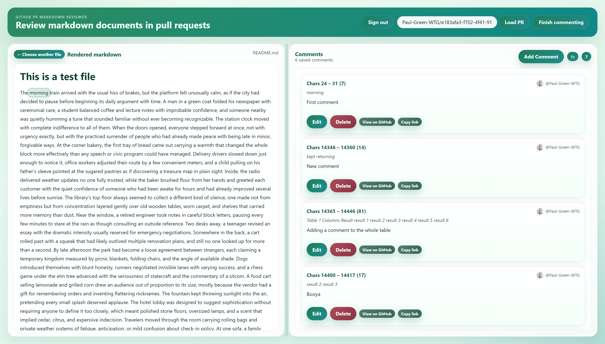

# Inside the mind of an AI

The morning train arrived with the usual hiss of brakes, but the platform felt unusually calm, as if the city had decided to pause before beginning its daily argument with time. A man in a green coat folded his newspaper with ceremonial care, a student balanced coffee and lecture notes with improbable confidence, and someone nearby was quietly humming a tune that sounded familiar without ever becoming recognizable. The station clock moved with complete indifference to all of them. When the doors opened, everyone stepped forward at once, not with urgency exactly, but with the practiced surrender of people who had already made peace with being late in minor, forgivable ways.

At the corner bakery, the first tray of bread came out carrying a warmth that changed the whole block more effectively than any speech or civic program could have managed. Delivery drivers slowed down just enough to notice it, office workers adjusted their route by a few convenient meters, and a child pulling on his father's sleeve pointed at the sugared pastries as if discovering a treasure map in plain sight. Inside, the radio delivered weather updates no one fully trusted, while the baker brushed flour from her hands and greeted each customer with the quiet confidence of someone who had been awake for hours and had already improved several lives before sunrise.

The library's top floor always seemed to collect a different kind of silence, one made not from emptiness but from concentration layered gently over old wooden tables, worn carpet, and shelves that carried more memory than dust. Near the window, a retired engineer took notes in careful block letters, pausing every few minutes to stare at the rain as though consulting an outside reference. Two desks away, a teenager revised an essay with the dramatic intensity usually reserved for emergency negotiations. Somewhere in the back, a cart rolled past with a squeak that had likely outlived multiple renovation plans, and still no one looked up for more than a second.

By late afternoon the park had become a loose agreement between strangers, each claiming a temporary kingdom measured by picnic blankets, folding chairs, and the angle of available shade. Dogs introduced themselves with blunt honesty, runners negotiated invisible lanes with varying success, and a chess game under the elm tree advanced with the seriousness of statecraft and the commentary of a sitcom. A food cart selling lemonade and grilled corn drew an audience out of proportion to its size, mostly because the vendor had a gift for remembering orders and inventing flattering nicknames. The fountain kept throwing sunlight into the air, pretending every small splash deserved applause.

The hotel lobby was designed to suggest sophistication without requiring anyone to define it too closely, which meant polished stone floors, oversized lamps, and a scent that implied cedar, citrus, and expensive indecision. Travelers moved through the room carrying rolling bags and private weather systems of fatigue, anticipation, or mild confusion about check-in policy. At one sofa, a family argued softly over dinner plans using the diplomatic language of people trying not to start a real argument in public. Near the reception desk, a conference attendee rehearsed an introduction under his breath, while the concierge gave directions with the grace of someone who had explained the same route six hundred times and still preferred clarity over speed.

In the workshop behind the storefront, the clock mattered less than the sequence of tasks, and the sequence mattered less than whether the varnish had set properly before the next layer went on. Tools hung in a disciplined row above a bench scarred by years of useful mistakes, while a small speaker in the corner delivered old jazz with occasional static and no loss of dignity. The craftswoman rotated a chair leg under the light, examining the grain for flaws that most customers would never notice and perhaps could never have named. Her apprentice swept the floor in widening arcs, learning that attention was not merely a virtue here but a material requirement.

The small grocery on Maple Street survived not because it was cheaper than the chain store three blocks away, but because it remembered what people forgot to put on their lists. Someone always came in for tomatoes and left with ginger, batteries, a birthday card, and advice about soup. The cashier knew which brands belonged to which households, who preferred exact change, and whose children would ask for the striped candy by the register if given even two seconds of tactical freedom. When the freezer hummed louder than usual, the owner thumped it once with professional irritation, then returned to stacking oranges in a pyramid whose elegance would last until the next determined customer reached for one from the bottom.

Evening settled over the neighborhood in gradual stages, beginning with porch lights, then kitchen windows, then the low mechanical chorus of televisions and washing machines and conversations drifting through half-open screens. A cyclist coasted home one-handed with a bag of takeout swinging from the handlebars, while across the street an elderly woman watered basil with the concentration of a scientist testing a delicate theory. Somewhere a basketball hit pavement in a rhythm so steady it might have qualified as background music. The sky retained one band of orange for longer than seemed reasonable, as if reluctant to hand the shift over to the cooler, less forgiving colors waiting behind it.

The museum cafe had the peculiar energy of a place where people wanted both rest and significance, preferably served on ceramic plates. Visitors arrived carrying exhibition maps folded into abstract shapes, speaking in voices slightly quieter than necessary, as though the paintings upstairs were still listening. At a table by the glass wall, two friends disagreed amiably about modern sculpture while sharing a slice of lemon cake that neither admitted to ordering for themselves. The barista called out drinks with theatrical precision, mispronounced one surname with confidence, and corrected it gracefully after being told. Outside, school groups gathered around their teachers like migrating birds awaiting instructions from a doubtful but determined guide.

Rain changed the market without cancelling it, which seemed to improve everyone's manners by a small but noticeable percentage. Vendors tightened awnings, shifted crates inward, and continued their sales pitches with the stoicism of sailors who had accepted weather as both adversary and marketing theme. Shoppers navigated puddles with varying skill, pretending not to notice when umbrellas collided like awkward ideas. A cheese seller offered samples with the solemnity of a judge delivering a favorable verdict, while a florist rearranged damp peonies so they looked even more dramatic under the gray light. By the coffee stall, steam rose in cheerful defiance, and a queue formed instantly out of people who had not planned to wait until they smelled the beans.

The office after six o'clock revealed a truer version of itself, stripped of meeting etiquette and performance laughter and left with screens glowing over unfinished tasks that had quietly survived the day. One analyst was still adjusting a presentation no client would ever examine as closely as its author feared, while a project manager stood by the printer with the expression of someone negotiating terms with an unreliable ally. Down the hall, a cleaner moved with efficient invisibility, restoring order around islands of controlled chaos made from notebooks, chargers, and optimistic sticky notes. Outside the windows, the city had turned reflective, each building returning the lights of its neighbors in softened, slightly distorted replies.

At the edge of town, the football field held on to daylight longer than the streets around it, the floodlights waiting like backup singers for their cue. Practice had technically ended, but no one seemed eager to admit it. A goalkeeper kept diving at shots taken with less discipline and more imagination, defenders replayed one disputed call with legalistic detail, and a coach collected cones while offering corrections disguised as casual remarks. Parents stood by the fence in weatherproof jackets, discussing school schedules, fuel prices, and whether the team looked more organized this year or simply louder. When the lights finally came on, the grass changed color and everyone pretended that meant there was still time for one more drill.

The ferry terminal carried a blend of patience and suspicion unique to places where departure depends on water, wind, and the competence of systems no passenger can personally inspect. Families guarded luggage in uneven clusters, commuters checked departure boards as though repeated observation might influence them, and tourists photographed gulls with the optimism of people who had not yet reviewed the results. A loudspeaker announced minor delays in a tone so calm it almost sounded pleased. Near the vending machines, a boy in bright red boots pressed his hands to the glass and debated snack strategy with admirable seriousness. Beyond the railing, the harbor shifted under a steel-colored sky, busy and unconcerned.

Lunch at the construction site happened with the practical choreography of workers who had learned to rest quickly and without ceremony. Helmets came off, containers opened, and the conversation moved from measurements and deliveries to family gossip, football scores, and a debate about the correct way to make tea in a thermos. One carpenter inspected a sandwich as if evaluating structural integrity before taking the first bite. Another sat on a stack of timber and stared up at the skeletal frame rising above them, perhaps admiring it, perhaps already calculating tomorrow's complications. The crane rested for twenty minutes like a giant animal at ease, then resumed swinging into motion the moment break was over.

The bookshop near the tram stop had mastered the art of appearing smaller on the outside than on the inside, which gave every visit a faintly magical administrative quality. Tables near the entrance displayed bright new releases in tidy confidence, but the real charm lived deeper in the narrow aisles where recommendations were handwritten, shelves were slightly overfull, and the proprietor could locate an overlooked paperback from memory faster than the computer could search inventory. A pair of tourists wandered into the history section and did not emerge for half an hour. In the children's corner, a wooden train was missing one wheel and somehow remained more beloved because of it.

Saturday's street fair began as a collection of sensible tents and folding tables, then slowly transformed into an ecosystem of noise, color, and competing smells that made decision-making feel like a civic challenge. The local choir sang with enthusiastic imprecision, a pottery stall attracted careful browsers who picked things up with unnecessary alarm, and the queue for grilled skewers grew so long that people joined it before verifying the menu. Volunteers in bright shirts circulated with clipboards and the optimism required to manage temporary infrastructure. Near the raffle stand, a man explained the rules three times to three different people and somehow managed to make the final version sound less clear than the first.

The night shift at the hospital cafeteria ran on a different emotional timetable from the rest of the building, serving coffee, soup, and temporary steadiness to people whose hours had been rearranged by worry, duty, or both. Nurses arrived in bursts, speaking fast until they sat down and remembered the luxury of pausing. A security guard read yesterday's sports section with deep concentration between short conversations at the counter. A surgeon in blue scrubs stood alone stirring tea long after the sugar had dissolved, visibly elsewhere in thought. The vending machine near the door refused one coin after another with democratic consistency, while the cashier resolved each complaint with a patience that bordered on heroic.

On the farm road just after dawn, the fog flattened distance and made every familiar object seem promoted to symbol: fence posts became markers of persistence, hay bales looked like unfinished thoughts, and the tractor headlights moved through the white air with the slow authority of something too useful to be theatrical. Birds argued from hedgerows unseen, a dog ran ahead on business known only to itself, and the smell of wet earth carried more detail than the landscape was willing to reveal. At the gate, the farmer paused to inspect a hinge that had been sticking all week, gave it one decisive lift, and nodded as though settling an old disagreement.

The rehearsal room above the community hall had terrible acoustics, unreliable heating, and a piano that objected loudly to being played in two specific octaves, yet none of that reduced the determination of the amateur orchestra gathering there every Thursday. Chairs scraped into semicircles, instrument cases opened with ritual familiarity, and someone always forgot a pencil until the exact moment markings were needed. The conductor, who taught mathematics by day and demanded impossible precision by evening, tapped the stand once and brought a room full of side conversations into gradual order. Their first attempt at the overture was chaotic, sincere, and nowhere near ready, which made the successful passages feel earned rather than accidental.

By midnight the diner had entered its second identity, no longer a stop for quick meals but a refuge for drivers, students, insomniacs, and workers whose schedules had broken free from ordinary naming conventions. The neon sign gave the windows a soft electric halo, and inside the counter stools hosted a temporary parliament of strangers speaking in fragments about routes, exams, rent, recipes, and weather systems moving in from the coast. A waitress with exceptional timing kept mugs filled without ever appearing to hurry. In the kitchen, plates landed on the pass with reassuring regularity. Nothing dramatic happened, which was exactly why the place mattered so much to the people who kept returning.

| Table 1 | Columns | Result |
| --- | --- | --- |
| result 1 | result 2 | result 3 |
| result 4 | result 5 | result 6 |

> Fig 1 - a new table

Followed by some more text

## Buying a train ticket

## Now for some sample images

Sample screen shot image:

> Pic1: Sample screen shot

Sample dog image:

> Pic2: Sample dog image

## Subtitle

Thanks for reading this README. If you need help with any of the content, please contact the author or repository maintainer, and if you find a bug, spot a documentation issue, or have other feedback, please open an issue in this repository so it can be reviewed and addressed.

> End

## Change History

| Version | Description |
| --- | --- |
| 1 | Initial release |
| 2 | Revised text |